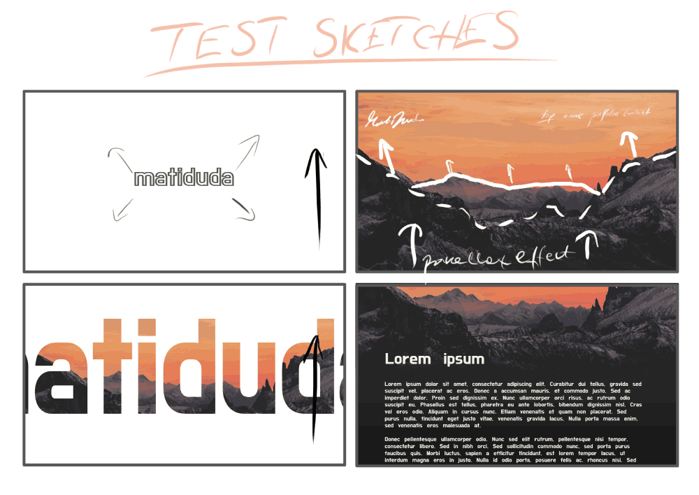

<h1>
    <a href="https://www.matiduda.pl/" style="color: white; text-decoration: underline;text-decoration-style: dotted;">matiduda.pl
    </a>
    &larr; <i>click</i>
</h1>

Overview
===

This is my simple personal website project. It was built so I can show all of my work in one place in visually interesting way.

In the future I aspire to embed here some of the interactive projects and make the website more interactive.

## Built with
---

- [HTML5 Bones](https://github.com/iandevlin/html5bones) - basic html template
- [Normalize.css](http://necolas.github.com/normalize.css/), used by the above
- [Background picture](https://unsplash.com/@kilarov345)
- **heavily inspired by**:
    - [this](https://www.youtube.com/watch?v=htrE84htqhM) svg animation tutorial
    - [Filip](https://www.youtube.com/channel/UCG7EBd-JrRZehNv9e5m1fQQ)'s great [parallax effect tutorial](https://www.youtube.com/watch?v=rLrLJQBG_qo)

### Sketches
---

### TODO
====

- Sections:
    - [ ] About me
    - [ ] Projects
    - [ ] CV
    - [ ] Contact me
- [ ] Responsive design
- [x] Scalable .svg logo
- [x] Parallax mountain
- [x] Navbar
